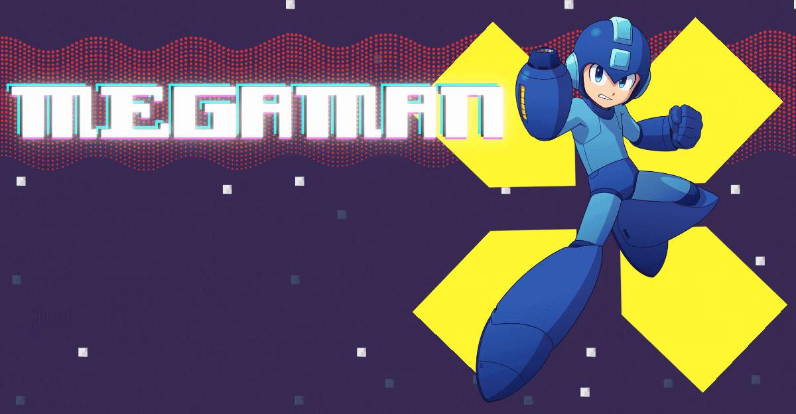
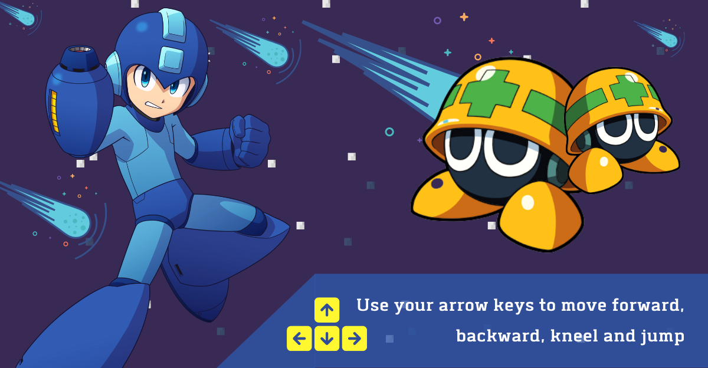
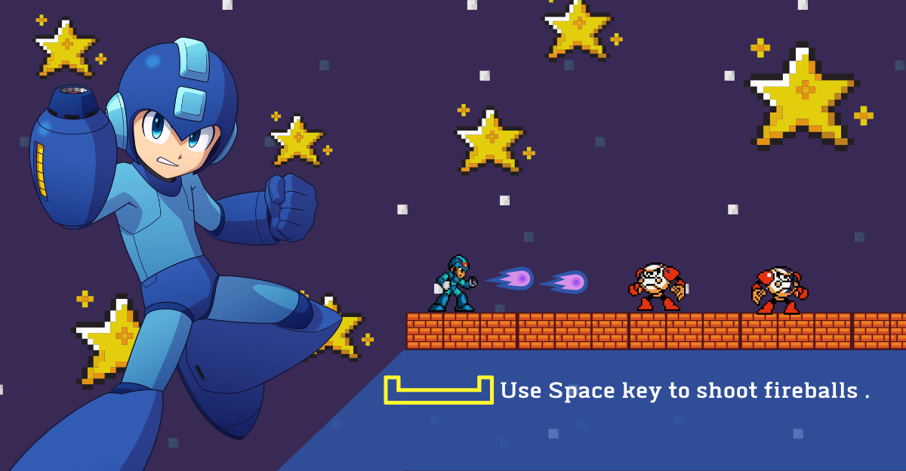
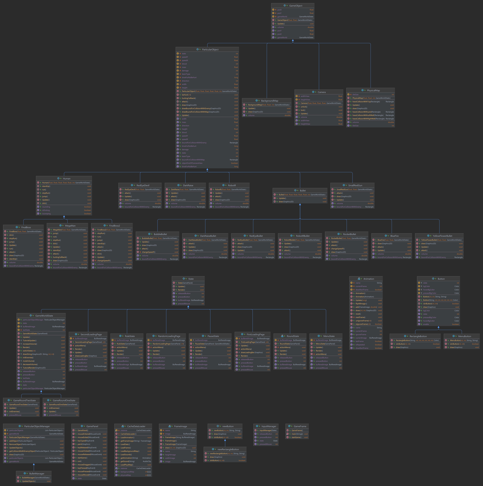

 
  

<h1 align="center"> MegaMan </h1>
<h3 align="center"> HCMIU - OOP Final Project - Semester 2 2021 - 2022 </h3>
<h5 align="center"> C'est accepté Team </h5>

 
  

<!-- TABLE OF CONTENTS -->
<h2 id="table-of-contents"> :book: Table of Contents</h2>

  
Table of Contents

  <ol>
    <li><a href="#about-the-game"> ➤ About The Game</a>
      <ol>
        <li><a href="#intro"> Introduction</a></li>
        <li><a href="#rules"> Rules</a></li>
        <li><a href="#demo"> Demo</a></li>
      </ol>
    </li>
    <li><a href="#about-the-project"> ➤ About The Project</a>
      <ol>
        <li><a href="#built-with"> Built With</a></li>
        <li><a href="#uml"> UML</a></li>
        <li><a href="#probs"> Original source code problems</a></li>
        <li><a href="#upgraded-features"> Upgraded Features</a></li>
        <li><a href="#future-features"> Future Features</a></li>
        <li><a href="#challenges"> challenges</a></li>
        <li><a href="#tasks-allocation"> Tasks Allocation</a></li>
      </ol>
    </li>
    <li><a href="#references"> ➤ References</a></li>
    <li><a href="#contributors"> ➤ Contributors</a></li>
  </ol>

<!-- ABOUT THE GAME -->
<h2 id="about-the-game"> :cloud: About The Game</h2>

<h3 id="intro"> Introduction </h3>

 
  For those who not familiar with Mega Man, in the story behind the original series, Mega Man is a robot originally named Rock, created as a lab assistant by the scientist Dr. Light with Dr. Wily as his partner. Following treachery by Dr. Wily in which he reprogrammed most of Dr. Light's robots, Rock volunteered to be converted into a fighting robot to defend the world from Wily's violent robotic threats, thus becoming Mega Man.

<h3 id="rules"> Rules </h3>
  
  
  
<h3 id="demo"> Demo </h3>
  

<!-- ABOUT THE PROJECT -->
<h2 id="about-the-project"> :pencil: About The Project</h2>

<h3 id="built-with"> Built With </h3>
  <ul>
    <li>IDE: IntelliJ IDEA</li>
    <li>Language: Java</li>
    <li>Library: standard Java libraries, JavaFX (for sound feartures)</li>
    <li>Tools: Paint / Adobe Photoshop CS6 / Canvas (design particular objects), <a href="https://twistedwave.com/online">make background soundtrack</a>, <a href="https://www.text-image.com/convert/ascii.html "> convert maps</a>.</li>
  </ul>
  
  
<h3 id="uml"> UML </h3>
  

  
<h3 id="probs"> Original source code problems </h3>
  <ul>
    <li>The bullets go through the  wall </li>
    <li>Bugs in the physical map lead to some situation that the main character can go through the wall and fall outside the map</li>
    <li>Single round</li>
    <li>Non user-friendly interface</li>
  </ul>
  
<h3 id="upgraded-features"> Upgraded Features </h3>
  <ul>
    <li>Add logic method to prevent the bullets to go through the walls</li>
    <li>Design a better looking user interface (Main menu, Rules menu, Pause menu, loading screen)</li>
    <li>Add a new boss Armored Armadillo (the appearance, skills, animations)</li>
    <li>Add the Sound manager in the pause menu</li>
    <li>Use MouseActionEvent buttons</li>
    <li>Create multiple rounds</li>
    <li>Modify blood and damage of enemies logically</li>
  </ul>
  
<h3 id="future-features"> Future Features </h3>
  <ul>
    <li>Add a longer/ wider map</li>
    <li>Extend the number of the megaman ability: fire elements megaman will shoot fire blaster, dark megaman will shoot something like moon bullet</li>
  </ul>
  
<h3 id="challenges"> Challenges </h3>
  <ul>
    <li>Lack of appropriate data resources (maps, sprites)</li>
    <li>Smoothen frame transition</li>
  </ul>
  
<h3 id="tasks-allocation"> Tasks Allocation </h3>
<a href="https://www.notion.so/4bac6d54b55e472f8f504cfaeec929e9?v=c0ef56e9580f4325b66a8838f31708a3"> Notion</a>

<!-- REFERENCES -->
<h2 id="references"> :scroll: References </h2>
<a href="https://github.com/phamngocthachlt6c/rockman/tree/master/src/com/gamestudio"> Github - phamngocthachlt6c</a> 

<!-- CONTTRIBUTORS -->
<h2 id="contributors"> :small_orange_diamond: Contributors</h2>

**Nguyễn Trọng Nghĩa - ITITIU20257**  
**Lâm Quốc Dinh - ITITIU20002**       
**Châu Thị Thanh Trúc- ITITIU20327**  
**Dương Khánh Duy - ITITIU20194**  

